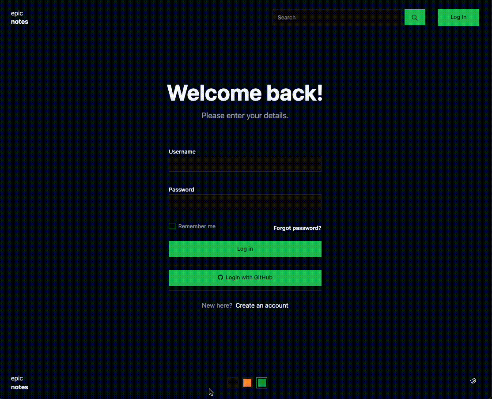

# Epic stack with Shadcn themes

- This project implements [Shadcn themes](https://ui.shadcn.com/themes) on Epic
  Stack.
- This is a port of [Theme example](https://github.com/shadcn/example-ui-themes) to Epic Stack.
- Themes are rendered server side with **optimistic UI**.

## How to run locally

- Clone the repo.
- Run `npm i & npm run dev`.
